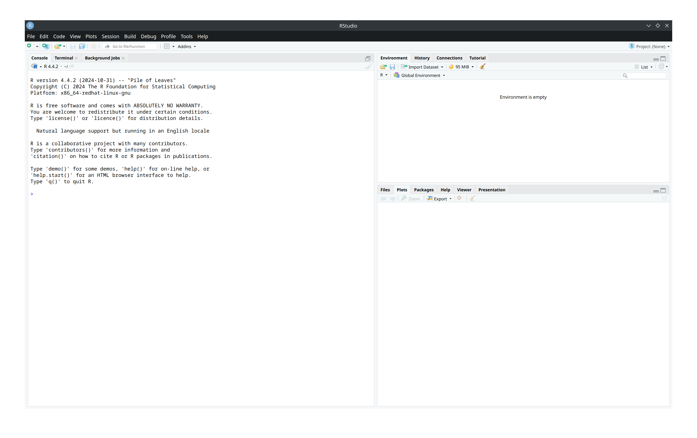

# Manual System Identification with R

Prerequisites:
- [R Installation](https://www.r-project.org/)
- The RStudio IDE (used by this tutorial) or PyCharm with the R extension (they have UI elements that make the workflow MUCH easier and so few professionals use R without them)

## Data Collection

To fully sample the state-space of the mechanism, we will need to observe a steady output ramp *and* its response to step-changes in output. It is recommended to either run two tests (one with a steady ramp from 0 output and one with a single large step output) or a combined "stairstep" test (multiple small steps that combined form the shape of a ramp). Implementing these tests on your robot and recording the Data is left as an exercise for the reader, but WPILib's `SysIdRoutine` class and DataLogTool's ability to export specific DataLog entries as a CSV are both very useful here.

## Using R

Upon installing and opening RStudio, you should be greeted by this screen:

